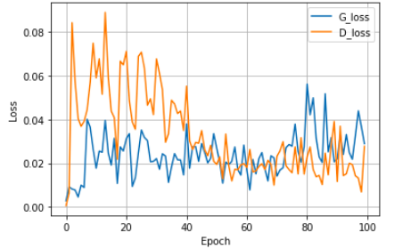
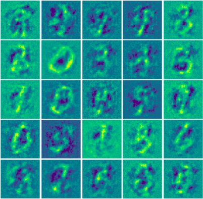

# Generative Adversarial Networks
TensorFlow implementation of Generative Adversarial Network (GAN) applied on [MNIST](http://yann.lecun.com/exdb/mnist/) dataset 

## Table of Contents
* [Implementations](#implementations)
* [Comparisons](#comparisons)
* [Notes](#notes)

## Implementations
1. [GAN with Linear Layers](#gan-with-linear-layers)
2. [GAN with Linear Layers and Batch Normalization](#gan-with-linear-layers-and-batch-normalization)
3. [GAN with 2D CNN and Batch Normalization (DCGAN)](#gan-with-2d-cnn-and-batch-normalization-dcgan)
4. [GAN with 2D CNN and Spectral Normalization](#gan-with-2d-cnn-and-spectral-normalization)

### GAN with Linear Layers
* Resuts 
<table align='center'>
<tr align='center'>
<td> Generated Sample </td>
<td> Loss </td>
</tr>
<tr>
<td>
<td>
</tr>
</table>

### GAN with Linear Layers and Batch Normalization
* Resuts 
<table align='center'>
<tr align='center'>
<td> Generated Sample </td>
<td> Loss </td>
</tr>
<tr>
<td>
<td>
</tr>
</table>

### GAN with 2D CNN and Batch Normalization (DCGAN)
* Resuts 
These results are generated using 2000 images only and 100 epoch just to reduce the time of training 
<table align='center'>
<tr align='center'>
<td> Generated Sample </td>
<td> Loss </td>
</tr>
<tr>
<td>
<td>
</tr>
</table>

### GAN with 2D CNN and Spectral Normalization
* Resuts 
These results are generated using 2000 images only and 100 epoch just to reduce the time of training 

<table align='center'>
<tr align='center'>
<td> Generated Sample </td>
<td> Loss </td>
</tr>
<tr>
<td>
<td>
</tr>
</table>

## Comparisons
* **Generated Samples**  
These results are generated using 2000 images only and 100 epoch in the four architectures to train the model and compare between different architectures 

<table align='center'>
<tr align='center'>
<td> GAN </td>
<td> GAN with batch normalization</td>
</tr>
<tr>
<td>
<td>
</tr>
<tr align='center'>
<td> GAN with 2d CNN and batch normalization</td>
<td> GAN with 2D CNN and Spectral Normalization</td>
</tr>
<tr>
<td>
<td>
</tr>
</table>
 
 

## Notes 
* To replicate and run this code you just need to run it on google colab.
* Increasing the number of data will get you a better result so you can change this in the notebook.  
